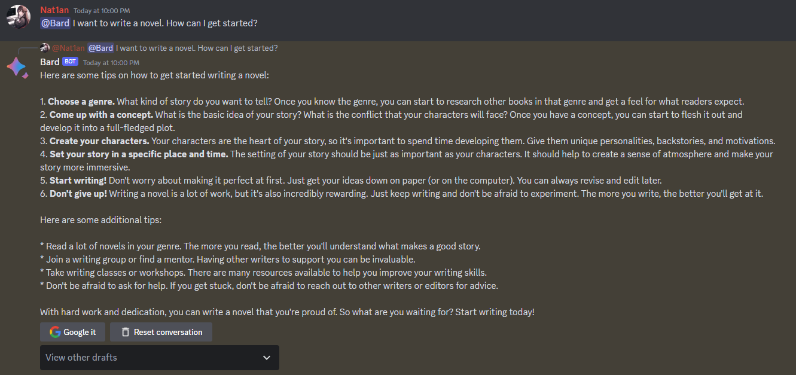

# Bard

Google Bard, but on Discord.

The reverse engineering is modified from [acheong08/Bard](https://github.com/acheong08/Bard), added async features.

## Screenshot



## Usage

You need to install Python 3.10+ first.

1. Clone the repository
    ```bash
    git clone https://github.com/Nat1anWasTaken/Bard
    ```
2. Install dependencies
    ```bash
    pip install -r requirements.txt
    ```
3. Obtain session id
    - Go to https://bard.google.com/
    - F12 for console
    - Session: Go to Application → Cookies → __Secure-1PSID. Copy the value of that cookie.

4. Rename `.env.example` to `.env` and fill in the token
    ```dotenv
    TOKEN=discord_bot_token_here
    SESSION_ID=google_session_id_here
    OWNER_ID=discord_user_id_here
    OWNER_ONLY=1_or_0
    ```
5. Run the bot
    ```bash
    python main.py
    ```
